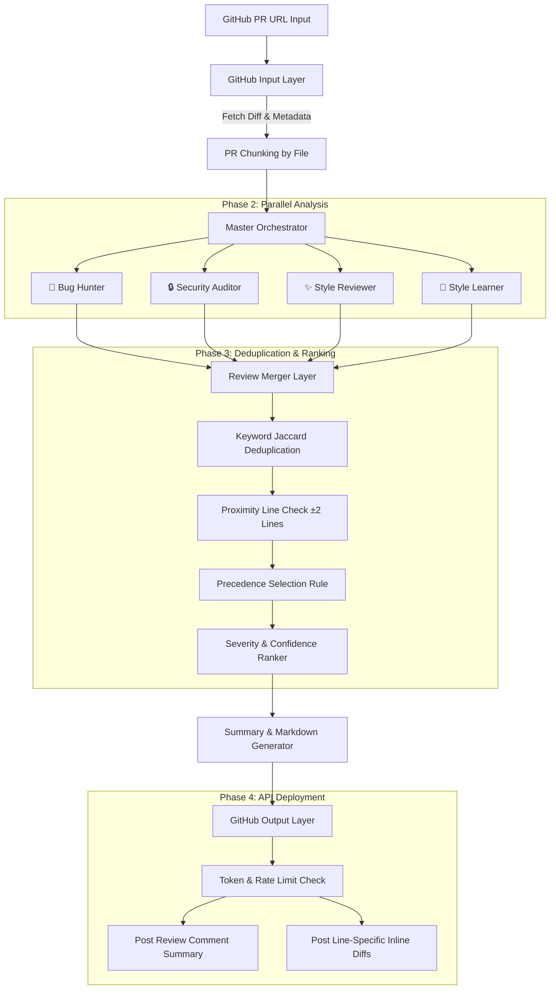
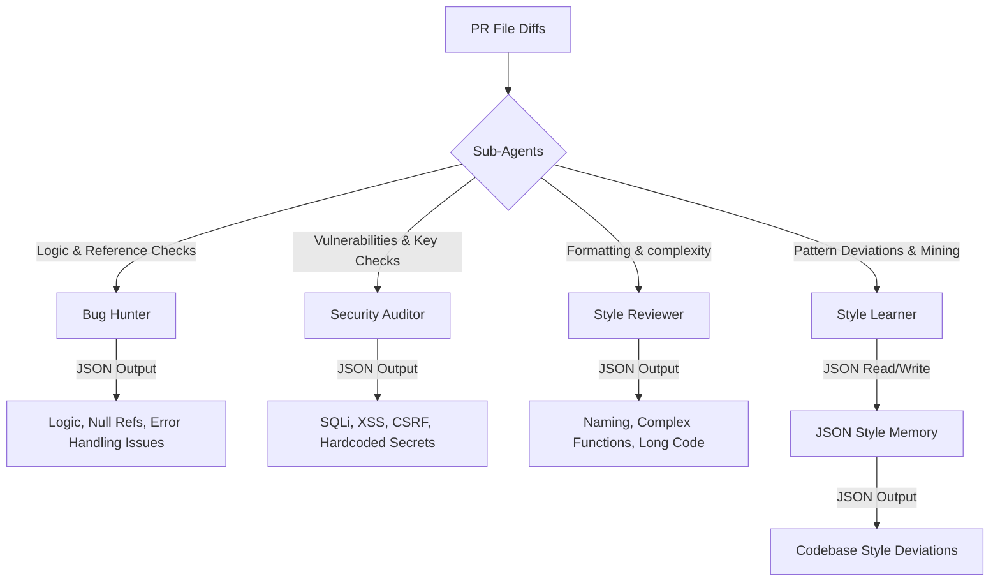
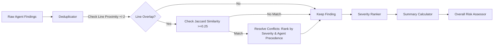
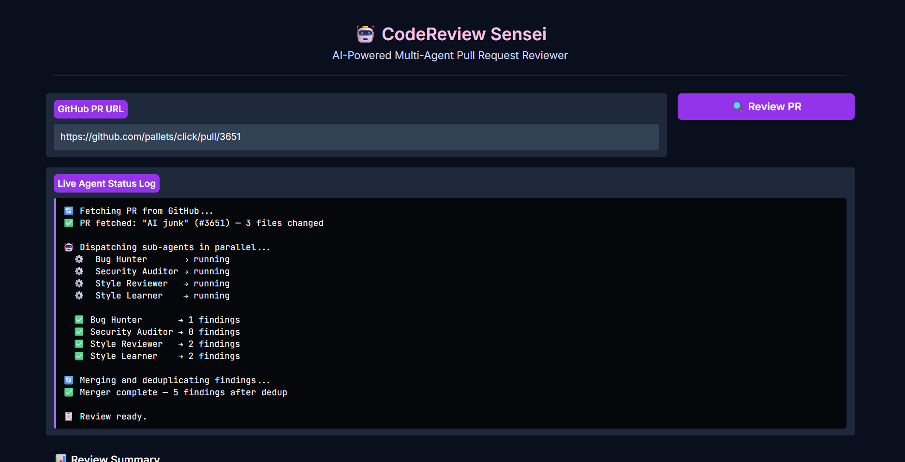

# Sensei (CodeReview Sensei)

**CodeReview Sensei** is an automated, multi-agent AI system designed to review GitHub Pull Requests. When a user provides a PR URL, the system fetches the diff from GitHub, routes it in parallel to four specialized sub-agents running asynchronously (Bug Hunter, Security Auditor, Style Reviewer, and Style Learner), deduplicates and ranks findings using a master orchestrator, and publishes structured comments back to GitHub.

The unique **Style Learner** dynamically mines coding style patterns specific to the codebase and records them in a JSON memory store, flagging subsequent pattern deviations to ensure consistent engineering practices.

---

## 🏗️ System Architecture & Data Flow

Below is the complete data flow of **CodeReview Sensei** from input URL to GitHub deployment:



---

## 🧠 Detailed Agent Architecture

Each agent is a focused, single-responsibility class powered directly by **Gemini 2.5 Flash** using un-fenced JSON output configurations:



### 1. 🐛 Bug Hunter Agent
Focuses strictly on operational code reliability:
* Off-by-one errors and loop boundary conditions.
* Null pointer, undefined object, or unhandled `None` references.
* Missing error handling, bare `except` blocks, and unhandled exceptions.
* Flawed boolean assertions or logic branches.

### 2. 🔒 Security Auditor Agent
Audits security posture against OWASP Top 10 standards:
* Input validation flaws (SQL Injection, XSS, CSRF).
* Exposure of hardcoded passwords, tokens, API keys, and credentials.
* Broken access controls, authentication bypasses, or missing session verification.
* Sensitive data leaks or logging of credential elements.

### 3. 🌟 Style Reviewer Agent
Monitors design patterns, code cleanliness, and readability guidelines:
* Poor nomenclature (inconsistent variable, class, or function names).
* Missing or poor docstrings/inline documentation.
* High cyclomatic complexity (functions handling too many responsibilities).
* Redundant code blocks, unused imports, or dead code fragments.

### 4. 🧠 Style Learner Agent (Unique Differentiator)
Mines and preserves team-specific coding patterns:
* **Memory Sync**: Operates on a lightweight local JSON memory structure (`memory/team_style_memory.json`).
* **Deviation Auditing**: Compares the target PR files against previously logged patterns, flagging anomalies or rule deviations.
* **Pattern Mining**: Analyzes the new changes to identify recurring developer preferences (e.g. wrapper preferences, testing utilities, specific naming structures), updating the occurrences score and saving it back to the store.

---

## 🏆 Review Merger & Deduplication Logic

When sub-agents execute in parallel, multiple agents may flag overlapping or identical issues at the same lines. The **Review Merger** resolves this by executing the following filter pipeline:



1. **Proximity Line Window Check**: Findings are grouped by filename. If two findings fall within a window of $\pm2$ lines of each other, they enter duplicate validation.
2. **Jaccard Semantic Keyword Check**: Computes keyword Jaccard similarity after removing standard stop words. If Jaccard similarity is $\ge0.25$, they are flagged as semantic duplicates.
3. **Conflict Resolution Rules**: When two findings are marked as duplicates, the merger keeps the stronger finding by comparing:
   * **Severity Level**: Keeps the higher severity level (`critical` > `high` > `medium` > `low`).
   * **Confidence Score**: Keeps the finding with the higher model confidence level.
   * **Precedence Rules**: If both are tied, it retains the findings from the operational agents (`Bug Hunter` or `Security Auditor`) over formatting/style agents.

---

## 📸 Interface Preview


---

## 🛠️ Getting Started

### 1. Install Dependencies
```bash
pip install -r codereview_sensei/requirements.txt
```

### 2. Configure Credentials
Add a `.env` file under `codereview_sensei/` pointing to your GitHub PAT and Gemini Key:
```env
GITHUB_TOKEN=your_token_here
GEMINI_API_KEY=your_key_here
```

### 3. Run the App
* **Console Command Line**:
  ```bash
  python codereview_sensei/main.py
  ```
* **Gradio GUI Dashboard**:
  ```bash
  python codereview_sensei/app.py
  ```
  *(Launches a dark-themed user-friendly interface displaying agent logs, custom stats tables, and markdown code comments).*
